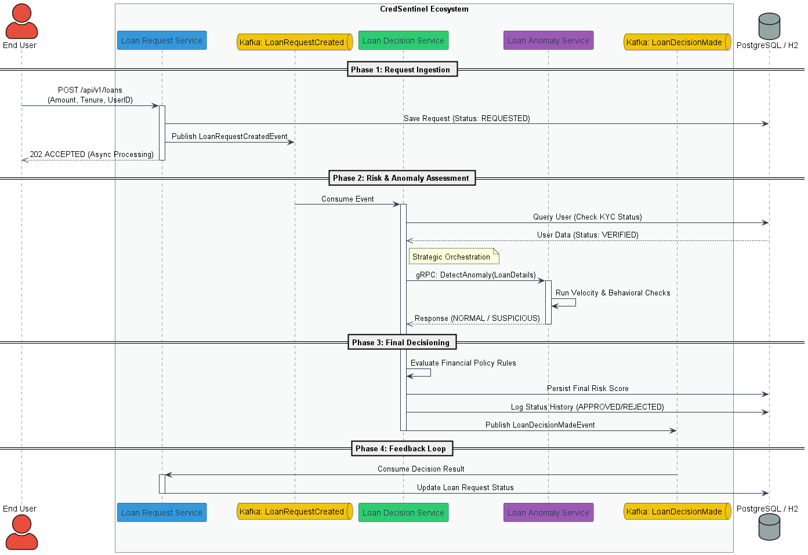

# 📌 CredSentinel: Distributed Loan Decisioning System

## 🚀 Overview
**CredSentinel** is a high-performance, event-driven fintech platform designed to evaluate micro-loan requests (₹500–₹5,000) and detect behavioral anomalies in near real-time.

Inspired by the architectures of modern Indian fintech lenders like **KreditBee, Slice, and Paytm Postpaid**, this system demonstrates production-grade **Java Spring Boot** microservices, **Kafka-based choreography**, and **gRPC-driven** risk assessment.

---

## 🏗 System Architecture
The system follows a decoupled, asynchronous flow to ensure high availability and low latency for the end-user.

1.  **Loan Request Service (Spring Boot)**: The entry point that receives REST requests and returns a `202 Accepted`. It persists the initial request in the `loan_request` table and triggers the downstream flow via Kafka.
2.  **Loan Decision Service (Spring Boot)**: The "Policy Brain". It consumes loan events, orchestrates risk checks, and applies automated financial rules to reach an approval or rejection.
3.  **Loan Anomaly Service (Spring Boot + gRPC)**: A specialized detection engine exposed via gRPC. It performs low-latency behavioral analysis, such as velocity checks and synthetic identity detection.

---

## High Level Flow


## 🧠 Key Features & Patterns
* **Event-Driven Choreography**: Uses **Apache Kafka** for inter-service communication to ensure loose coupling and high throughput.
* **High-Performance gRPC**: Synchronous communication between Decision and Anomaly services using **Protobuf** contracts for minimal overhead.
* **Domain-Driven Design (DDD)**: Clear separation between financial policy (Decisioning) and behavioral risk (Anomaly).
* **Auditability**: Every transition is logged in a `loan_status_history` table, providing a complete trail for financial compliance.

---

## 🛠 Tech Stack
* **Backend**: Java 17, Spring Boot 3.3.5
* **Messaging**: Apache Kafka
* **Communication**: gRPC (Google Remote Procedure Call)
* **Database**: PostgreSQL (Primary) / H2 (Development/Testing)
* **Build Tool**: Maven

---

## 📊 Data Modeling
The system maintains a rigorous schema to handle high-volume lending operations:

| Table | Responsibility |
| :--- | :--- |
| **`users`** | Core user profile, KYC status (`PENDING`, `VERIFIED`, `REJECTED`), and identifiers. |
| **`loan_request`** | Main record for loan amount, tenure, and current state. |
| **`risk_score`** | Composite view of credit scores, anomaly flags, and final risk rankings. |
| **`loan_status_history`** | Immutable audit log of every status change (e.g., `REQUESTED` -> `APPROVED`). |


---

## 🚀 Getting Started

### Prerequisites
* Java 17+
* Apache Kafka (Local or Docker)
* Maven

### Running the Services
1.  **Generate Proto Classes**:
    ```bash
    mvn clean compile
    ```
2.  **Start Loan Anomaly Service**: Listens on gRPC port `9091`.
3.  **Start Loan Decision Service**: Listens for Kafka events on `CredSentinel.LoanRequestCreated`.
4.  **Start Loan Request Service**: Exposes REST API on port `8080`.

---

## 🧪 Testing
The project includes a comprehensive suite of **Component Tests** using:
* **EmbeddedKafka**: To test the end-to-end event flow without external dependencies.
* TBA -> **Mock gRPC Servers**: To validate the Decision Service logic in isolation.
* **H2 In-Memory DB**: To verify data persistence and state transitions.